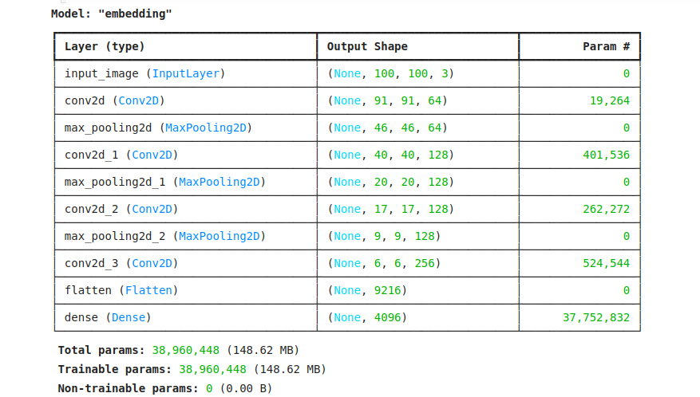

**🚀 Current Progress & Next Steps:**

✅ Current Status: The model has been trained successfully.

⏳ Next Steps: The next phase is to develop a UI to visualize the results interactively.

# Siamese Neural Networks for One-shot Face Verification

## 📖 Theoretical Overview
This project is an implementation of the paper:

> **Siamese Neural Networks for One-shot Image Recognition**  
> *Gregory Koch, Richard Zemel, Ruslan Salakhutdinov - 2015*  
> [Link to Paper](https://www.cs.toronto.edu/~rsalakhu/papers/oneshot1.pdf)

The objective is to develop a face verification system that leverages **Siamese Neural Networks** to recognize whether two images belong to the same person with minimal training examples. This aligns with the concept of **one-shot learning**, where models are trained to generalize from very few labeled examples.

## 🧠 Key Theoretical Concepts
### **1. One-shot Learning**
Traditional deep learning models require large datasets to generalize effectively. However, **one-shot learning** aims to recognize unseen classes with only **one** or very **few** examples. This is particularly useful for face verification, where collecting large labeled datasets for every new person is impractical.

### **2. Siamese Neural Networks**
A **Siamese Network** consists of two identical subnetworks with shared parameters. Given two images, the network learns a similarity function that determines whether they belong to the same class.

- **Input:** Two images (Anchor, Candidate)
- **Embedding Network:** A shared convolutional neural network (CNN) that extracts feature representations from both images.
- **L1 Distance Layer:** Computes absolute differences between feature vectors.
- **Sigmoid Activation:** Outputs a probability score indicating similarity.

### **3. Loss Function: Contrastive Loss**
To train the network, we use a loss function designed to push similar images closer and dissimilar ones farther in the embedding space:

\[ L(x_1, x_2) = y \cdot ||f(x_1) - f(x_2)||^2 + (1 - y) \cdot max(0, m - ||f(x_1) - f(x_2)||)^2 \]

where:
- \( x_1, x_2 \) are the input images.
- \( f(x) \) is the CNN embedding function.
- \( y \) is 1 if images belong to the same class, 0 otherwise.
- \( m \) is a margin value to prevent collapsing the embeddings.

### **4. Model Architecture**

Our Siamese network consists of:
- **Convolutional layers:** Feature extraction with ReLU activation.
- **Max pooling layers:** Downsampling to retain important spatial features.
- **Fully connected layers:** Producing a compact embedding.
- **L1 distance + Sigmoid layer:** Computes similarity score between embeddings.

### **5. Training Strategy**
- **Dataset:** The model is trained using pairs of images (same/different class pairs).
- **Augmentation:** Affine transformations are used to improve robustness.
- **Optimization:** Adam optimizer with learning rate decay.
- **Early Stopping:** Monitored via one-shot validation performance.

## 🏆 Expected Outcomes
- The model should generalize well to unseen identities.
- Achieve **high accuracy** in one-shot face verification tasks.
- Demonstrate that verification learning extends to classification problems.

## 📜 References
- Koch, G., Zemel, R., & Salakhutdinov, R. (2015). *Siamese Neural Networks for One-shot Image Recognition*. ICML.
- Bengio, Y. (2009). *Learning Deep Architectures for AI*. Foundations and Trends in Machine Learning.
- Hinton, G. et al. (2006). *A Fast Learning Algorithm for Deep Belief Networks*. Neural Computation.

---
🚀 **If you find this project useful, consider starring ⭐ it on GitHub!**

